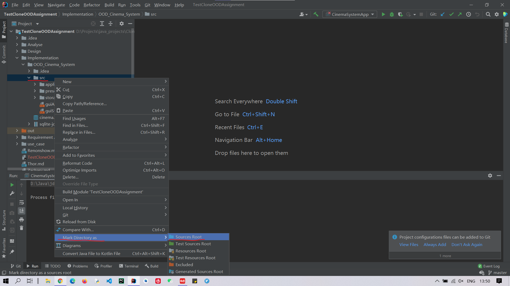
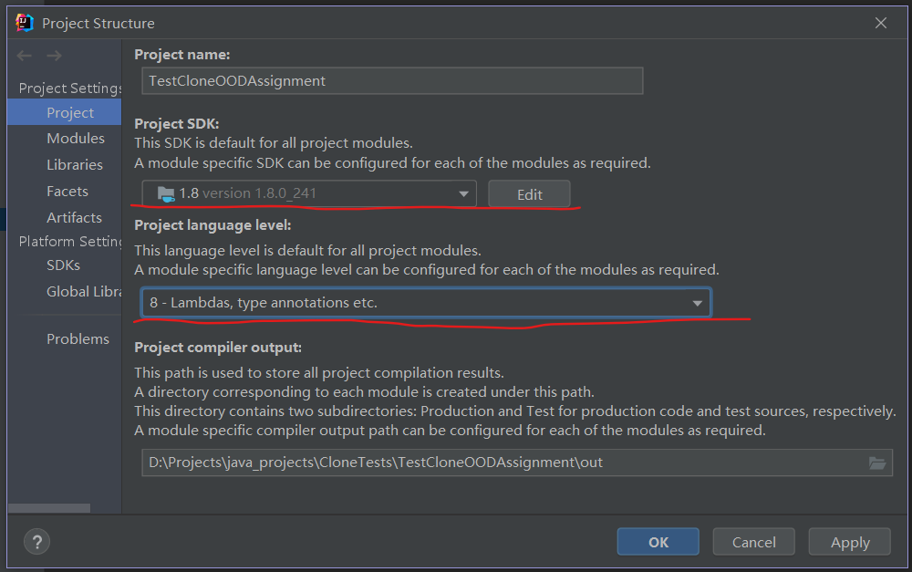
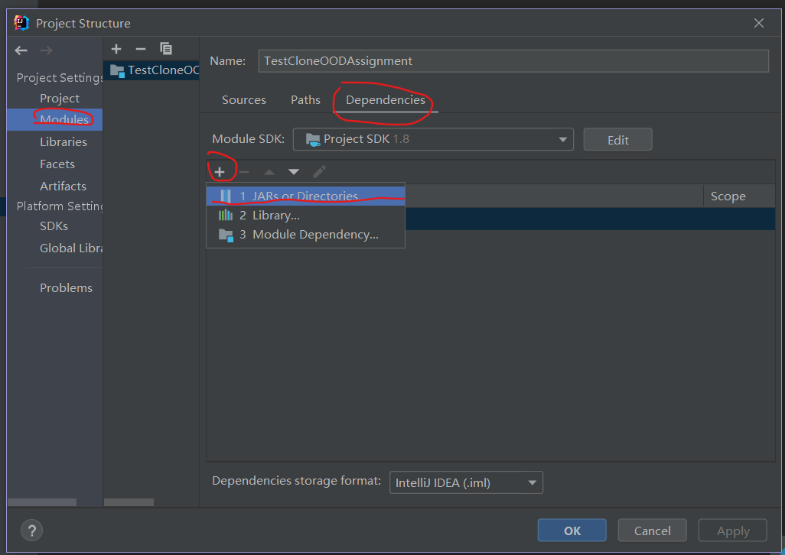
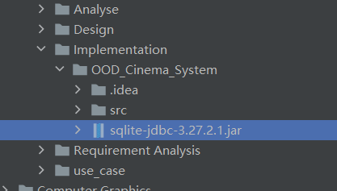
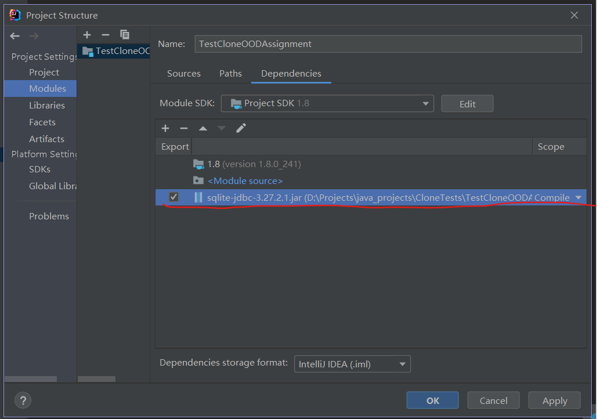
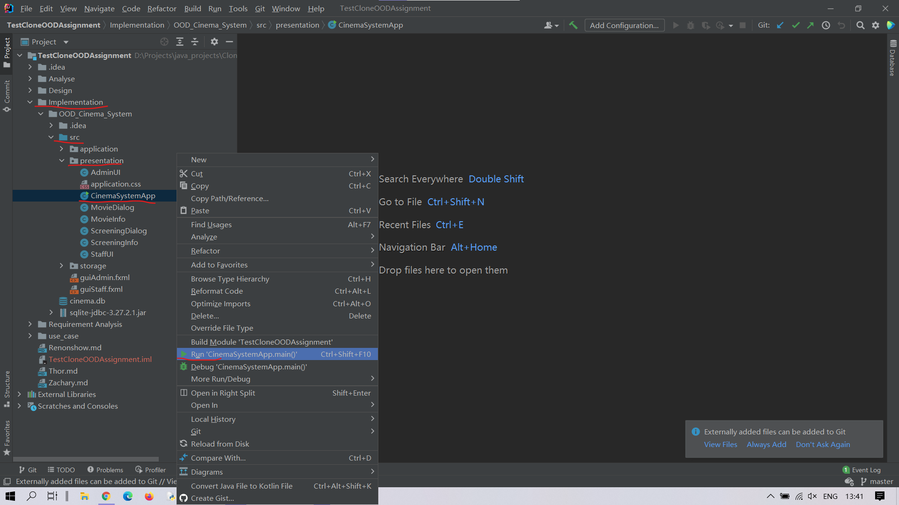

# Cinema Management System

This is a system designed and implemented in object-oriented method. This system aims to assist the administrator to arrange movies and screenings as well as teller to sell tickets in a simple procedure.

At the start of application running, the system requires the user to act as an administrator or a teller. The selection will lead user to either administrator panel or teller panel. Within the administrator panel, the user can operate below actions: "Add Movie", "Add Screening", "Cancel Screening", "Update Screening", "Cancel Selected". Within the teller panel, the user can operate below actions: "Sell Tickets", "Cancel Selected". Any of the above actions is connected with the back-end of the system so alerting dialogs will appear while action executed unproperly.

## Getting Started

This instruction will tell you how to run this application on your machine.

## Prerequisites

Java SDK 1.8

## How to run our Cinema System project
### Step 1:
#### Clone the project from Gitlab
Gitlab repo (Clone with SSH):  
`git@csgitlab.ucd.ie:comp3013-2021/group5/cinema-management-and-booking-system.git`

Gitlab repo (Clone with HTTPS):  
`https://csgitlab.ucd.ie/comp3013-2021/group5/cinema-management-and-booking-system.git`

Using the following command (in your local terminal) to clone our project  
`git clone https://csgitlab.ucd.ie/comp3013-2021/group5/cinema-management-and-booking-system.git`

### Step 2:
#### Mark the resources root directory

*Mark the resources root directory*

### Step 3:
#### Set SDK and Language Level
Like the following picture shows:
1. SDK should be int version **1.8** 
2. Language level should be **8** 

*Set SDK and Language Level*

### Step 4:
#### Add dependency for JDBC

*Add jar dependency*

*Choose sqlite-jdbc-3.27.2.1.jar as dependency*

*Tick the jar package of jdbc then "Apply"*

### Step 5:
#### Run the program

*Run the program*

## Features

### Use Case 1:  Display Screening

In use case one, existed screenings on a specific date will be displayed in both administrator and teller panels.

### Use Case 2:  Add Movie

In use case two, a movie including its detailed information will be added, so this movie can be selected while scheduling a new screening.

### Use Case 3:  Schedule Screening

In use case three, a new screening including its detailed information will be scheduled into the system.

### Use Case 4:  Cancel Screening

In use case four, an existing screening(previously scheduled) will be removed from the system. 

### Use Case 5:  Update Screening

In use case five, the detailed information of an existing screening of a movie will be adjusted.

### Use Case 6:  Sell Tickets

In use case six, the sold ticket number of a specific screening will be adjusted.

## Authors
Name|XXX student number|GitLab Username
:---|:---:|:---:
Wade|XXX|@XXX
Thor|XXX|@XXX
Ball|XXX|@XXX
